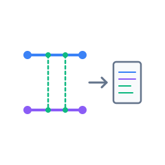

# gh-pr-formatter

<div align="center" markdown="1">

<!--  -->



</div>

> 過去バージョンのドキュメントはこちら  
> [`docs/archive/README.md`](./docs/archive)

GitHub GraphQL API を利用して、**マージ済み Pull Request を自動収集し、Markdown 形式に整形する** CLI ツールです。

## Features

- 直近のマージ済み PR を取得
- Author ごとに PR 番号をグルーピング
- テンプレートを使って Markdown に整形

## How it works

1. **環境をチェック**
   - カレントディレクトリが `.git` 管理下か確認
   - GitHub Token が設定されているか確認（Keychain / 環境変数）

2. **`main` ブランチの最新マージ日時を取得**
   - `hotfix/xxx` 形式のブランチは除外して検索

3. **その日時から現在までに `develop` へマージされた PR を収集**

4. **PR を author（ログイン名）ごとにグルーピング**

5. **Markdown に整形して出力**

```shell
./releasePrMarkdown/release_YYYYMMDD_hhmm.md
```

## Installation

GitHub GraphQL API にアクセスするため、対応する実行ファイルを Releases
からダウンロードして使用してください。

## Usage

基本的な利用方法は以下のとおりです。

### Authentication

GitHub Token はキーチェーン（OS の資格情報ストア）に保存して利用します。

```shell
# 対話プロンプトで Token を保存
gh-pr-formatter auth login

# 保存済み Token を確認
gh-pr-formatter auth status

# Token を削除
gh-pr-formatter auth logout
```

CI など対話入力ができない環境では、環境変数 `GH_PR_FORMATTER_TOKEN` に Token を設定してください。

### Default behavior

カレントディレクトリが Git 管理リポジトリである場合、そのリポジトリを対象として処理を実行します。

```shell
gh-pr-formatter
```

### Specify a repository

`--repo` オプションを使用すると、対象リポジトリを明示的に指定できます。

```shell
gh-pr-formatter --repo owner/repo

# e.g.
gh-pr-formatter --repo 4okimi7uki/gh-pr-formatter
```

> `--repo` は、カレントディレクトリが Git 管理下でない場合に必須です。

## Output

以下の形式でファイルが生成されます。

```shell
./releasePrMarkdown/release_YYYYMM_HHmm.md
```

生成された Markdown をコピーして、PR などに貼り付けて利用できます。

## Commands

| Command       | Description                            |
| ------------- | -------------------------------------- |
| `list`        | List merged pull requests              |
| `auth login`  | Save your GitHub token                 |
| `auth status` | Show the current authentication status |
| `auth logout` | Remove the saved GitHub token          |

<!--## 開発者向け

### Build

Go のクロスコンパイル機能を利用して、各 OS（Linux / macOS / Windows ）向けの実行バイナリを生成できます。
成果物はすべて `./dist` 配下に出力されます。

#### 個別 OS 用のバイナリを生成

環境に応じた 1 種類のバイナリを生成します。

```bash
make
```

#### すべての OS 向けバイナリをまとめて生成

```bash
make build-all
```

以下のような形式で出力されます：

```
dist/
├── gh-pr-formatter-mac-amd64
├── gh-pr-formatter-mac-arm64
├── gh-pr-formatter-linux-amd64
└── gh-pr-formatter-windows-amd64.exe
```

マルチプラットフォームに配布したいときは `make build-all` が便利です。

```shell
// format コマンド
golangci-lint run

// 依存関係整理
go mod tidy
```

----->

---

<small>2025 [Aoki Mizuki](https://github.com/4okimi7uki) – Developed with 🍭 and a sense of fun.</small>
