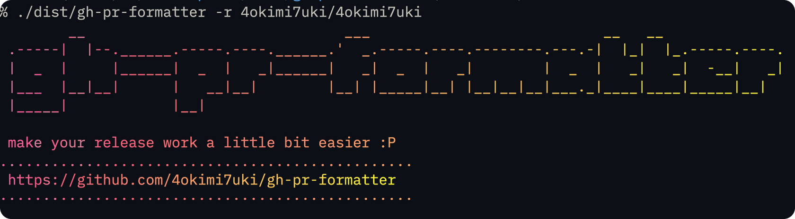

# gh-pr-formatter

<div align="center" markdown="1">

<!---->


 

</div>

> 過去バージョンのドキュメントは [こちら](./docs/archive)

<div align="center">
    
</div>

GitHub GraphQL API を直接叩いて **マージ済み Pull Request を自動収集 & Markdown に整形** する CLI ツールです。

- 直近のマージ PR を取得
- Author ごとに番号をグルーピング
- テンプレートを使って Markdown に整形

## 動作フロー

1. **環境チェック**

- カレントディレクトリが `.git` 管理下か確認
- GitHub Token がセットされているか確認（Keychain / 環境変数）

2. **`main` ブランチの最新マージ日時を取得**

- `hotfix/xxx` 形式のブランチは除外して検索

3. **その日時〜現在までに `develop` にマージされた PR を収集**
4. **PR を `author（ログイン名）`ごとにグルーピング**
5. **Markdown へ整形し、以下の形式で出力**

```
./releasePrMarkdown/release_YYYYMMDD_hhmm.md
```

## 使い方

GitHub GraphQL API へアクセスします。[Releases ページ](https://github.com/4okimi7uki/gh-pr-formatter/releases) から対応する実行ファイルをダウンロードしてください。
基本的な利用方法は以下のとおりです。

### 認証

GitHub Token をキーチェーン（OS の資格情報ストア）に保存して利用します。

```bash
# 対話プロンプトで Token を保存
./gh-pr-formatter auth login

# 保存済み Token を確認
./gh-pr-formatter auth status

# Token を削除
./gh-pr-formatter auth logout
```

CI など対話入力ができない環境では、環境変数 `GH_PR_FORMATTER_TOKEN` に Token を設定してください。

### デフォルト動作

カレントディレクトリが `Git` 管理リポジトリである場合、
そのリポジトリを対象として処理を実行します。

```bash
./gh-pr-formatter
```

### 任意リポジトリの指定（オプション）

`--repo` オプションを使用すると、対象とするリポジトリを明示的に指定できます。

```bash
./gh-pr-formatter --repo owner/repo

# e.g.
./gh-pr-formatter --repo 4okimi7uki/gh-pr-formatter
```

> `--repo` を指定した場合、カレントディレクトリが `Git` 管理下である必要はありません。

### Output

`./releasePrMarkdown/release_YYYYMM_HHmm.md` が生成されます。

中身をコピーしてPRに貼り付けてください！

<!--## 開発者向け

### Build

Go のクロスコンパイル機能を利用して、各 OS（Linux / macOS / Windows ）向けの実行バイナリを生成できます。
成果物はすべて `./dist` 配下に出力されます。

#### 個別 OS 用のバイナリを生成

環境に応じた 1 種類のバイナリを生成します。

```bash
make
```

#### すべての OS 向けバイナリをまとめて生成

```bash
make build-all
```

以下のような形式で出力されます：

```
dist/
├── gh-pr-formatter-mac-amd64
├── gh-pr-formatter-mac-arm64
├── gh-pr-formatter-linux-amd64
└── gh-pr-formatter-windows-amd64.exe
```

マルチプラットフォームに配布したいときは `make build-all` が便利です。

```shell
// format コマンド
golangci-lint run

// 依存関係整理
go mod tidy
```

----->

---

<small>2025 [Aoki Mizuki](https://github.com/4okimi7uki) – Developed with 🍭 and a sense of fun.</small>
